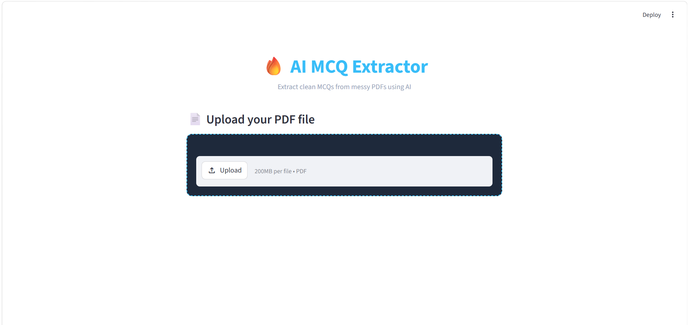

# 🔥 AI MCQ Extractor

An AI-powered application that extracts multiple-choice questions (MCQs) from unstructured PDF documents and converts them into clean, structured JSON format.

---

## 🚀 Overview

This project automates the extraction of MCQs from messy exam PDFs using a locally hosted AI model. It processes raw text, identifies valid questions, and structures them into a usable format.

The system is designed to handle noisy data, broken formatting, and large documents efficiently.

---

## ✨ Features

* 📄 Extracts text from PDFs using **pdfplumber**
* 🤖 Uses a locally hosted AI model (**LLaMA3 via Ollama**) for MCQ extraction
* ⚡ Handles large documents using chunking with overlap
* 🧹 Cleans and structures output into JSON format
* 🔁 Removes duplicate questions automatically
* 🖥️ Interactive UI built with **Streamlit**

---

## 🛠️ Tech Stack

* Python
* Streamlit
* pdfplumber
* Requests
* JSON
* Ollama (Local AI Model - LLaMA3)

---

## ⚙️ How It Works

1. Upload a PDF file through the UI
2. Extract raw text from each page
3. Split text into chunks for efficient processing
4. Send chunks to the AI model via Ollama API
5. Parse and clean JSON output
6. Remove duplicate questions
7. Display MCQs interactively

---

## ⚙️ Setup Instructions (Ollama Required)

### 1. Install Ollama

Download from: https://ollama.com

### 2. Pull and Run Model

```bash
ollama run llama3
```

### 3. Install Dependencies

```bash
pip install -r requirements.txt
```

### 4. Run the App

```bash
streamlit run app.py
```

⚠️ Make sure Ollama is running locally at:
http://localhost:11434

---

## 📌 Use Cases

* Exam paper analysis
* Question bank creation
* Educational content digitization
* Practice test generation

---

## 🧠 Key Highlights

* Handles unstructured and noisy PDF data
* Demonstrates AI integration in real-world applications
* End-to-end pipeline from raw PDF → structured MCQs

---

## 📷 Demo


.png)
.png)

---

## 🚧 Limitations

* Extraction accuracy depends on PDF quality
* Requires Ollama to run locally
* AI output may need minor cleaning in some cases

---

## 🚧 Project Status

This project is currently under development.

* MCQ extraction works for structured PDFs
* Performance may vary for complex or scanned documents
* Improvements in parsing and accuracy are in progress

---

## 🔮 Future Improvements

* Export to CSV / Excel
* Add answer key detection
* Improve extraction accuracy
* Deploy as a web application

---

## 📄 License

This project is for educational purposes.
